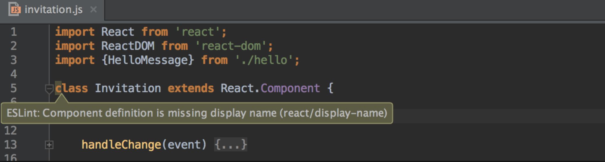

## Analogy between writing an essay and coding
A good essay not only cares whether the contents that an essay contains are good enough, but also cares whether an essay was written in right style and format. Coding is not different from writing an essay. Coding is actually very similar to writing an essay in terms of how an essay is written. A program would run without any problem even though source codes are not written under the coding standards. However, when programmers take a look at those unorganized source codes, they would not say those codes are good enough even though a program runs perfectly. Because source codes that disregard the coding standards are difficult to be reviewed by others, or not even by those who actually wrote codes.  

## Coding Standards, why is it so important?
Writing the source code by complying with coding standards are important in many ways. Most importantly, it makes the source code more readable. Source code has to be readable because we, humans, work on the source code. There could be a few brilliant developers who make programs on their own and their programs run perfectly. That does not happen to everyone. In most cases, developers need to work together to make a fine program and reviewing each other’s source code is necessary. Moreover, readable source code easily attracts other developers so that it is likely to be maintained with various upgrade in the future. 

## Conclusion
For ICS314 class, I was supposed to use an IDE called ‘IntelliJ’ and ESLint which provides users certain style guidelines. Although I recently figured out a way to work ESLint, I was impressed by the usefulness it provides to us. I felt as if I was writing an essay with a English teacher right next to me. It feels good to see my readable source code without effort.
