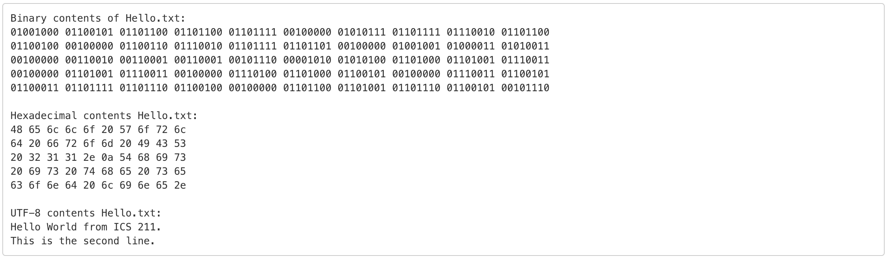

The purpose of this assignment was to create a Java program that prints out the contents of a file in different ways. There was a simple text file provided for the assignment,Hello.txt, and our objective was to print out the contents as binary, hexadecimal, and strings UTF-8 encoding. 

This assignment was quite shocking to me because it was the first ICS 211 assignment and I had to write lots of lines of code in order to make program work. I looked up lots of online resources, especially StackOverflow. However, after I got used to Eclipse(IDE for Java programming) and online resources, I was able to finish this assignment quite successfully. 

Source: <a href="https://github.com/hwangwooj/H00-ICS211"><i class="large github icon "></i>hwangwooj/H00-ICS211</a>
